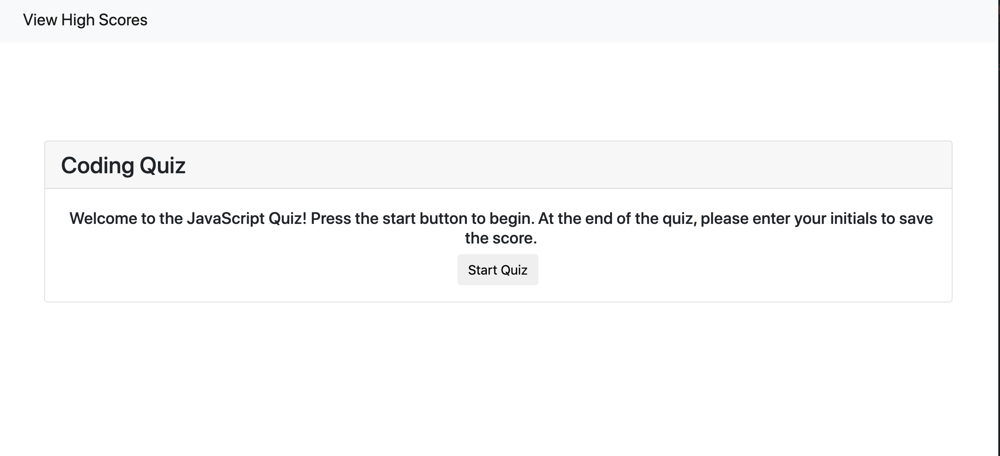

# Coding_Quiz

## Description

For this project, I have created a 10 question Javascript quiz that is timed. Each time an incorrect answer is chosen, the user is pentalized by losing seconds off the clock. The amount of seconds left at the end of the quiz is the final score for the user. The user is then prompted to enter their initials to save their final score.

The user is able to access a high scores page to view others scores. A clear button is also included in the page to clear all recent scores.

The project has been eployed at a live URL. To access the live URL, please click here [Coding_Quiz](https://alexhstrickland.github.io/Coding_Quiz/).

## Usage

When accessing the website, you will click on the start quiz button to begin taking the quiz. If you would like to view a screenshot of the website, check out .

